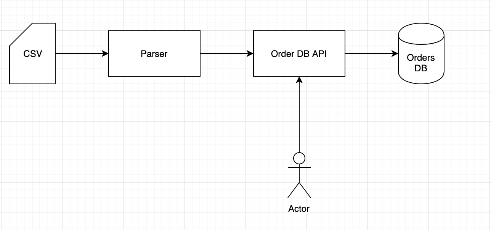

# Order DB API

### Diagram:


### GET Routes:

#### /parse 

###### Request examples: 
* /parse

###### Response examples: (format: json)
* (Response code 200)


##### Response codes:
| Response Code | Response Status |
|---------------|-----------------|
| 200           | Success              |
| 500           | Internal Server error|


### Developer's Corner:
```bash
git clone https://github.com/tk3413/tg-parser.git
cd parser
cp <your input file.csv> src/main/resources/input.csv
mvn clean install
mvn spring-boot:run
```